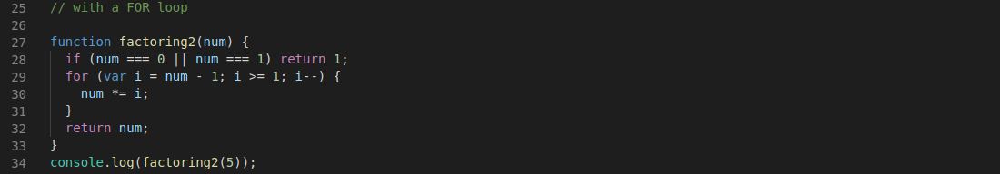

# 2nd solution on the "factoringNumber" exercise 

Step 1. Initiate the if statement to return 1 when the number input is  0 or 1

Step 2. Create the FOR loop

Step 3. Return the factorial of the provided integer
